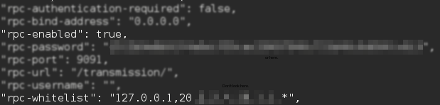
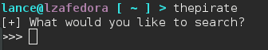
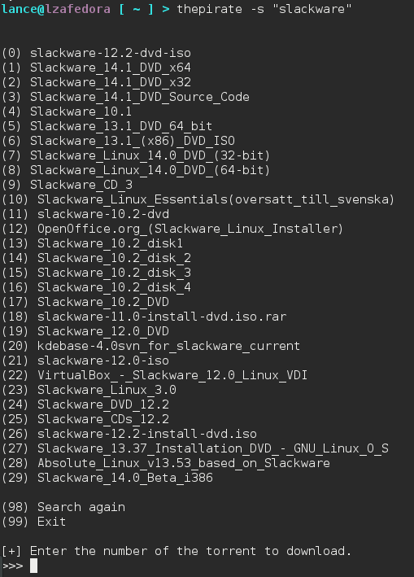
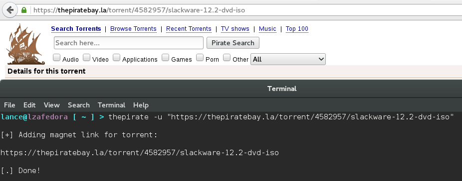
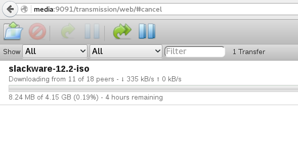
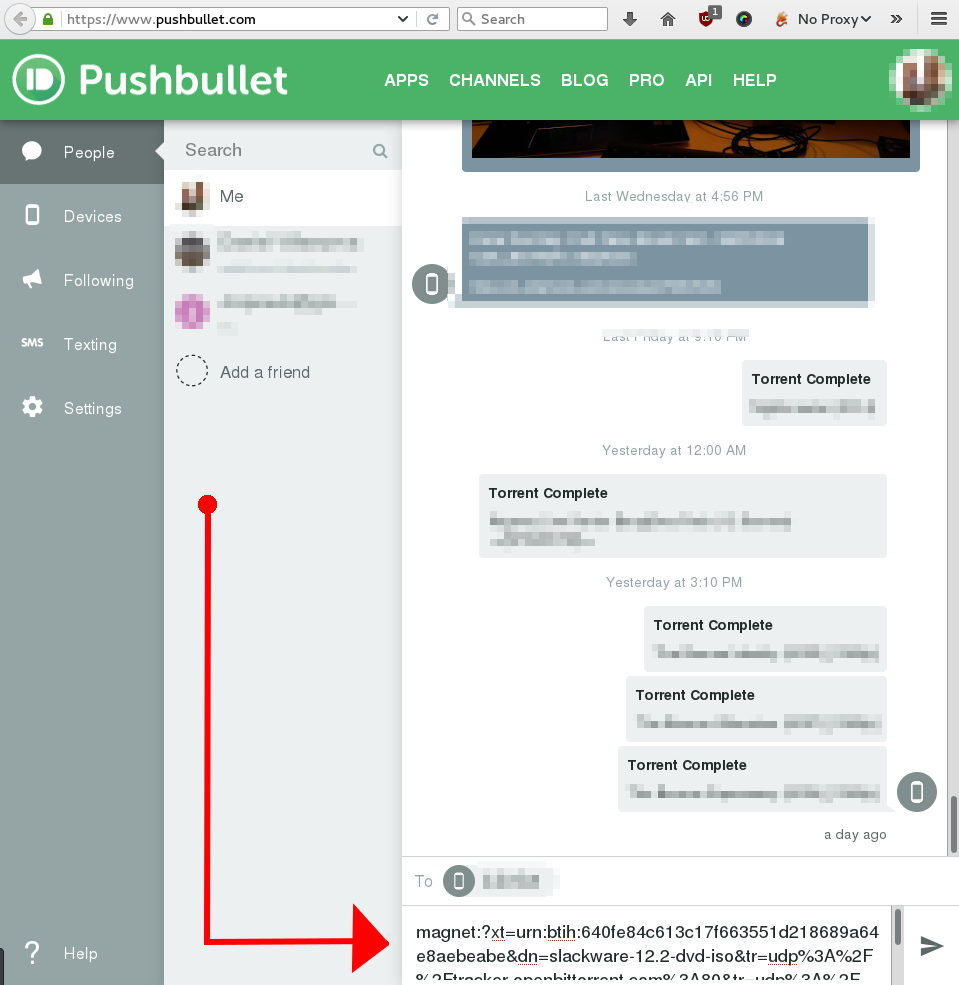

# The Pirate

#####Command line torrent downloader with [Pushbullet](https://pushbullet.com) notifications.

Add torrents to your Transmission download queue from anywhere, either via Pushbullet magnet link push or [remote procedure calls](https://trac.transmissionbt.com/wiki/rpc) direct to the machine.

-

Default behavior parses HTML pages on [ThePirateBay](https://thepiratebay.org) based on a search string provided, then passes the magnet link to a locally running Transmission-Daemon (localhost or same LAN).

Can also add direct HTML pages of the desired torrent with --url, and direct magnet links and torrent files with --file.

This script was written in Python version 2.7. Version 3 compatibility requires rewriting some code, and may be done at a later time. Pull requests welcome.

----

### Requirements

2 Parter. Either do it all on localhost, or configure a second machine for headless management.

 * Client setup
 * Server setup

## Client Side

3 external Python libraries needed. Please ensure the following are installed to the system

 * transmissionrpc
 * requests
 * beautifulsoup4

> TIP: If pip is installed, just run the following as root:

```
$ pip install -r requirements.txt
```

Then edit the thepirate.py file, and change the __rpcserver__ variable to the server's IP/hostname (if not localhost)

```
$ vim thepirate.py
# edit line 30, rpcserver variable
```


## Server Side

### Transmission

Transmission-daemon needs to be installed for downloading torrents.

RHEL/CentOS/Fedora (yum)

```
$ yum install transmission-daemon transmission-cli
```

Debian/Ubuntu (apt)

```
$ apt-get install transmission-daemon transmission-cli
```

Make sure the server running Transmission (if not localhost) is accepting traffic on port 9091/tcp and RPC is enabled in the Transmission settings.json file. Set your whitelist to your LAN subnet. Read about configuring Transmission [here](https://trac.transmissionbt.com/wiki/EditConfigFiles).



### Firewall

Open up the Transmission port if the server is not localhost.

Firewalld
```
$ firewall-cmd --add-port=9091/tcp --permanent
```

IPTables
```
$ iptables -A INPUT -p tcp --dport 9091 -j ACCEPT
```

### thepirate-satellite

[pushbullet.py](https://github.com/randomchars/pushbullet.py) is needed for Pushbullet notifications. You also need transmissionrpc on the server side so it can clear completed torrents.

```
$ pip install -r requirements.txt
```

Put your PushBullet API key in the api variable in the script and set a cron job to run thepirate-satellite.py every X minutes.

```
$ vim thepirate-satellite.py
# edit line 26, variable api
$ crontab cron.txt
```


### Usage

Place the script somewhere in your executable path. I like ~/bin

```
$ mkdir ~/bin
$ echo 'PATH=$PATH:~/bin' >> ~/.bashrc && source ~/.bashrc
$ cp pirate/thepirate.py ~/bin/thepirate
```

Then just run it. Supplying no arguments gives you a prompt.



Or supply a search string with the -s flag



You could even just supply the URL



Check your queue



Away from home? If you hooked up thepirate-satellite on a cron job, you can send a magnet link as a push. It will be picked up by the satellite script and added to your queue.



#### TODO

 * Comment script better; for personal reasons. I hate being confused 6 months later
 * Pushbullet read/download new torrents
 * Add config file support
 * Auto updater
 * Daily tally of script info (downloads, bandwidth, uploads, etc)
